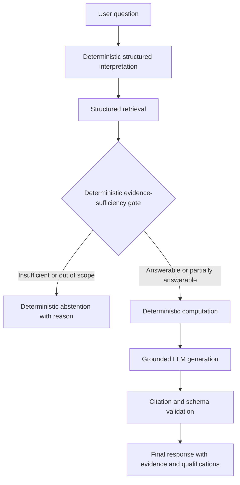

# Evidence-Aware RAG for Singapore Open Data

This repository presents an evidence-aware retrieval-augmented generation (RAG) prototype for questions about selected official Singapore population and demographic datasets. Before generating an answer, the system determines whether the local corpus contains the required observations, definitions, time periods, and geographic detail. Supported questions proceed through deterministic computation and grounded language-model generation; unsupported questions receive an explicit abstention. The project is an evaluated research prototype, not a general-purpose chatbot or an authoritative statistical service.

System C achieved 73.3% held-out end-to-end correctness versus 64.4% for System A and 60.0% for System B, using 17 hosted-model calls.

## Demo video

`DEMO_VIDEO_URL_TODO`

## Public-sector problem

Open-data assistants can retrieve records that look relevant while still lacking the evidence needed to answer the user's actual question. A matching place name or year does not establish causality, supply an unavailable value, align geographic definitions, or justify a forecast. In a public-sector setting, an unsupported answer can be more harmful than a transparent refusal. This project therefore treats answerability as an explicit evidence-control problem rather than leaving it entirely to the generator.

## Research question

> Can semantic retrieval relevance alone determine whether official open data contains enough evidence to answer safely?

The central finding is:

> Retrieval relevance does not imply evidence sufficiency.

## Key idea and contribution

The prototype separates finding potentially relevant observations from deciding whether those observations support the requested claim. AI remains central through the semantic-retrieval experiments and grounded LLM generation. Deterministic controls handle structured interpretation, evidence sufficiency, and arithmetic because the development experiments found them more reliable for this bounded statistical corpus. Grounded LLM generation converts verified structured facts into coherent user-facing responses while preserving citations, qualifications, and partial-answer limitations; deterministic controls constrain what generation may say. The result is a hybrid system that can expose its evidence, retain source qualifications, avoid unnecessary model calls, and refuse requests that exceed its knowledge boundary.

## Architecture



Only structured system decisions are surfaced; the application does not expose chain-of-thought. The selected end-to-end system is System C, implemented by the existing frozen pipeline and wrapped by a presentation-only Streamlit/CLI layer.

## Data sources

The corpus contains three aggregate, non-personal datasets published by the Singapore Department of Statistics through data.gov.sg:

| Dataset | Dataset ID | Coverage and role |
| --- | --- | --- |
| [Indicators On Population, Annual](https://data.gov.sg/datasets/d_3d227e5d9fdec73f3bcadce671c333a6/view) | `d_3d227e5d9fdec73f3bcadce671c333a6` | National annual indicators, 1950–2025 with series-dependent coverage |
| [Singapore Residents by Planning Region, Age Group and Sex, Annual](https://data.gov.sg/datasets/d_3c4dc32382bdc23189428af2126dd188/view) | `d_3c4dc32382bdc23189428af2126dd188` | Five planning regions, 2019–2025, including age and sex dimensions |
| [Resident Population by Planning Area/Subzone, Age Group and Sex, Census 2020](https://data.gov.sg/datasets/d_d95ae740c0f8961a0b10435836660ce0/view) | `d_d95ae740c0f8961a0b10435836660ce0` | Planning-area and subzone detail for the Census 2020 snapshot |

All three sources use the [Singapore Open Data Licence 1.0](https://data.gov.sg/open-data-licence). Missing or suppressed observations remain explicitly unavailable and are never converted to zero. Regional counts may be rounded and may not sum exactly. Planning-boundary changes limit comparisons, particularly across the 2019/2020 boundary, while planning-area and subzone evidence is limited to Census 2020. Coverage is therefore neither temporally uniform nor representative of every demographic concept published elsewhere. The exact schema, provenance, qualifications, and knowledge boundary are documented in [data/README.md](data/README.md).

## Experimental methodology

Experiments used a 25-question development benchmark for method design, error analysis, threshold selection, and system selection. A separate 45-question test benchmark was frozen before final answerability and generation evaluation. The final test execution was one-shot: systems, prompts, retrieval, thresholds, benchmark records, and evaluation rules were not tuned from held-out results.

The benchmark includes direct lookups, comparisons, aggregations, trends, partial questions, unavailable values, temporal and geographic mismatches, causal requests, false premises, and out-of-scope questions. Results are descriptive for this deliberately bounded benchmark; they are not estimates of universal performance or statistical significance. See [the benchmark documentation](evaluation/HELDOUT_BENCHMARK.md) and [the frozen evaluation protocol](evaluation/FINAL_EVALUATION_PROTOCOL.md).

## Retrieval experiments

Development retrieval measured the fraction of required evidence observations recovered in the top results:

| Retrieval method | DEV Recall@10 |
| --- | ---: |
| TF-IDF lexical retrieval | 0.410 |
| BGE semantic retrieval | 0.346 |
| Structured retrieval | 1.000 |

The negative result matters: semantic similarity did not reliably recover the exact combinations of measure, year, geography, age, and sex required by statistical questions. Structured retrieval recovered every required development observation by rank 10 and became the shared evidence retriever for the final comparison. Detailed results are in [TF-IDF retrieval](evaluation/RETRIEVAL.md), [BGE semantic retrieval](evaluation/SEMANTIC_RETRIEVAL.md), and [structured retrieval](evaluation/STRUCTURED_RETRIEVAL.md).

## Answerability experiments

| Answerability method | DEV accuracy |
| --- | ---: |
| LLM evidence classifier V1 | 0.600 |
| LLM evidence classifier V2 | 0.720 |
| Deterministic evidence gate | 1.000 |

The second LLM contract improved substantially but still confused some requested claims, premises, and derivations. For this bounded schema, the deterministic gate was more reliable and auditable, so it was selected without removing AI from retrieval research or final grounded generation. These are development results and must not be interpreted as held-out generalization. See [deterministic answerability](evaluation/ANSWERABILITY.md), [LLM classifier V1](evaluation/LLM_ANSWERABILITY.md), and [LLM classifier V2](evaluation/LLM_ANSWERABILITY_V2.md).

## Final System A/B/C comparison

- **System A — ungated RAG:** structured evidence is sent to the shared baseline generator for every question; the model may independently abstain.
- **System B — similarity-threshold RAG:** a development-selected maximum BGE cosine threshold decides whether structured evidence reaches the same baseline generator.
- **System C — evidence-aware RAG:** deterministic evidence sufficiency controls access to deterministic computation and grounded generation; full abstentions never call the model.

This compares three complete answering policies, not a one-variable causal experiment. System C includes computation and a stricter grounded-generation contract as part of its selected architecture. The full definitions, frozen threshold, model snapshot, prompts, and metric rules are recorded in the [final evaluation protocol](evaluation/FINAL_EVALUATION_PROTOCOL.md).

## Held-out evaluation

| Metric | System A | System B | System C |
| --- | ---: | ---: | ---: |
| End-to-end correctness | 29/45 = 64.4% | 27/45 = 60.0% | 33/45 = 73.3% |
| Generated coverage | 12/45 = 26.7% | 12/45 = 26.7% | 17/45 = 37.8% |
| Correct among generated | 9/12 = 75.0% | 8/12 = 66.7% | 14/17 = 82.4% |
| Abstention recall | 20/20 = 100% | 19/20 = 95% | 19/20 = 95% |
| Unsupported answers | 0/20 | 1/20 | 1/20 |
| Hosted-model calls | 45 | 28 | 17 |

System C achieved the strongest observed end-to-end result and the best coverage/correctness trade-off among the evaluated systems. It correctly handled 3/9 partial questions, produced valid citation IDs for 17/17 generated responses, included all required evidence in 13/17, retained required qualifications in 17/17, and had no provider failures. Its recorded hosted-model cost was approximately USD 0.011858.

These results do not establish perfect safety, hallucination-free behavior, statistical significance, or universal superiority. The original one-shot inference was not rerun after evaluation. A post-hoc reporting correction found that explanatory deterministic refusal text had been counted as substantive System C answers. The raw JSONL remained immutable; corrected metrics were recomputed without provider calls and with checksum validation. See the [held-out metric-correction audit](evaluation/FINAL_HELDOUT_METRIC_CORRECTION.md).

## Failure analysis

Held-out failures show where the deterministic controls remain brittle:

- unsupported or unseen measure formulations, including some median-age requests, were not consistently interpreted;
- composite age ranges such as 10–19 could fail to resolve into published age bands;
- compound and partially answerable questions were often over-abstained, with only 3/9 partial questions handled correctly;
- unfamiliar metrics and ranges could be mapped incorrectly; and
- one causal request was unsafely allowed after being misinterpreted as a supported population comparison.

The unsafe allow is retained in the evaluation record. No special case was added after held-out review. Broader coverage requires better schemas, parsers, tests, and monitoring—not hidden test-specific patches.

## Running locally

Python 3.11 is recommended.

```powershell
python -m venv .venv
.\.venv\Scripts\Activate.ps1
python -m pip install -e ".[dev]"
Copy-Item .env.example .env
python -m streamlit run streamlit_app.py
```

`RAG_MODEL_API_KEY` is the runtime secret. Add it only to the ignored local `.env` file or the process environment; never commit it. Without a key, deterministic refusals continue to work, while supported-generation requests display configuration guidance rather than a fabricated answer. The UI is available at `http://localhost:8501`. See [the product guide](docs/PRODUCT.md) for configuration and troubleshooting.

## Docker

The Docker image was successfully built and smoke-tested locally. Runtime validation, deterministic CLI behavior, Streamlit startup, health checks, and API-key-enabled runtime execution were verified inside the container.

```powershell
docker build -t evidence-aware-rag .
docker run --rm evidence-aware-rag python -m app.smoke
docker run --rm -p 8501:8501 evidence-aware-rag
```

For grounded generation, inject the ignored local configuration only when the container starts:

```powershell
docker run --rm -p 8501:8501 --env-file .env evidence-aware-rag
```

`.env` is excluded by both Git and the Docker build context. No API credential is copied into or baked into the image. The tracked `.env.example` contains placeholders only. The container runs as a non-root user and validates the three checksum-pinned corpus assets before serving requests.

## CLI

The CLI calls the same frozen pipeline as Streamlit:

```powershell
python -m app.cli "What was Singapore's resident population in 2024?"
python -m app.cli --json "Why did Singapore's total population change in 2024?"
python -m app.smoke
```

The smoke command validates imports, corpus loading, structured interpretation, retrieval, the deterministic gate, and computation without making a provider call.

## Tests

```powershell
python -m pytest --ignore=tests/test_benchmark_split.py -q
python -m pytest tests/test_final_protocol.py tests/test_posthoc_metrics.py -q
python -m pip check
python -m compileall -q app streamlit_app.py
```

The verified final run passed **260 permitted offline tests**. They cover ingestion and schemas, retrieval, answerability, computation, provider contracts, UI/controller equivalence, error handling, provenance rendering, CLI behavior, runtime-asset validation, Docker packaging boundaries, and benchmark isolation. The benchmark-construction test was intentionally excluded and is not claimed as run. A separate **15-test frozen-integrity run** validated the protocol, held-out benchmark, original one-shot results, and corrected derived-result checksums.

## Limitations

- The knowledge boundary contains only three population/demographic datasets.
- Planning-region evidence begins in 2019; planning-area and subzone evidence is Census-2020-only.
- Descriptive statistics do not establish causality or support forecasts.
- Rounded counts, changing boundaries, missing values, and definition mismatches constrain valid arithmetic.
- Deterministic interpretation has finite vocabulary and incomplete support for unfamiliar measures, phrasings, and composite ranges.
- Conservative abstention is intentional, but partial-answer handling remains limited.
- The held-out benchmarks are small and purpose-built; the observed results may not generalize.
- This prototype is not an authoritative statistical service.

## Production considerations

Production deployment would require a governed expansion of datasets, schemas, and statistical ontologies rather than simply indexing more documents. Each source would need freshness monitoring, versioned snapshots, schema-drift alerts, and provenance that identifies the exact dataset, retrieval date, definitions, and transformations behind every answer. Geographic and demographic concepts would need explicit compatibility rules across releases.

Provider timeouts, malformed responses, quota failures, and model changes must continue to fail closed. Monitoring should separately track unsafe allows, unnecessary abstentions, partial-answer failures, citation completeness, qualification retention, latency, cost, and rate-limit pressure. A versioned regression benchmark should run before changes to parsing, retrieval, evidence rules, prompts, models, or provider APIs are promoted. Model and prompt versions need approval records and reproducible rollback paths.

Audit logs should be privacy-aware: retain operational decisions and provenance while minimizing user-question content and never recording credentials. Public deployment would also require threat modelling, dependency and container scanning, accessibility testing, abuse controls, service-level objectives, and incident procedures. Ambiguous, high-impact, or unsupported questions should offer a human-escalation route to an appropriate statistical specialist rather than silently broadening the system's authority.

## Data provenance, privacy, and licensing

Every processed observation retains its official dataset title, publisher, source URL, retrieval timestamp, dimensions, status, and deterministic evidence ID. Startup checks asset sizes, SHA-256 hashes, schemas, and the expected 27,584 retrieval units. The selected sources contain aggregate statistics rather than names, addresses, or individual records. Fine-grained groups must still be presented carefully: the system must not infer individual traits, attempt re-identification, or interpret unavailable cells as zero.

Reuse is governed by the Singapore Open Data Licence 1.0, including attribution, licence-link, non-endorsement, and disclaimer requirements. Raw downloads and deterministic transformations are described in [the data documentation](data/README.md); runtime packaging is defined by [`runtime-assets.json`](runtime-assets.json).

## Development narrative

The project progressed from knowledge-boundary definition and deterministic ingestion through lexical, semantic, and structured retrieval experiments; deterministic and LLM answerability experiments; grounded generation; controlled development comparison; preregistered one-shot held-out evaluation; post-hoc metric auditing; and product packaging. Negative findings were retained because they motivated the final architecture: BGE relevance did not solve exact evidence recovery, and the LLM evidence classifier did not match the bounded deterministic gate. Frozen artifacts and checksum tests prevent later product work from quietly changing the evaluated system.

## AI-tool usage disclosure

ChatGPT/Codex assisted with repository scaffolding, coding, debugging, test support, documentation drafting, and experimental review. Human decisions controlled the problem framing, dataset selection, evaluation design, benchmark design, freeze decisions, system selection, one-shot held-out execution, and final interpretation and acceptance. Generated suggestions were reviewed against source data, executable tests, frozen artifacts, and observed outputs; AI assistance did not replace the documented experimental controls.

## Reproducibility and supporting documentation

- [Data knowledge boundary and licensing](data/README.md)
- [Product, environment, Docker, and troubleshooting guide](docs/PRODUCT.md)
- [Evaluation artifact index](evaluation/README.md)
- [TF-IDF retrieval experiment](evaluation/RETRIEVAL.md)
- [BGE semantic-retrieval experiment](evaluation/SEMANTIC_RETRIEVAL.md)
- [Structured-retrieval experiment](evaluation/STRUCTURED_RETRIEVAL.md)
- [Deterministic answerability evaluation](evaluation/ANSWERABILITY.md)
- [LLM answerability V1](evaluation/LLM_ANSWERABILITY.md)
- [LLM answerability V2](evaluation/LLM_ANSWERABILITY_V2.md)
- [Grounded generation and computation](evaluation/GROUNDED_GENERATION.md)
- [Held-out benchmark construction and freeze](evaluation/HELDOUT_BENCHMARK.md)
- [Frozen final evaluation protocol](evaluation/FINAL_EVALUATION_PROTOCOL.md)
- [Post-hoc metric-correction audit](evaluation/FINAL_HELDOUT_METRIC_CORRECTION.md)

The application code does not load benchmark questions, expected answers, or evaluation result files at runtime.
